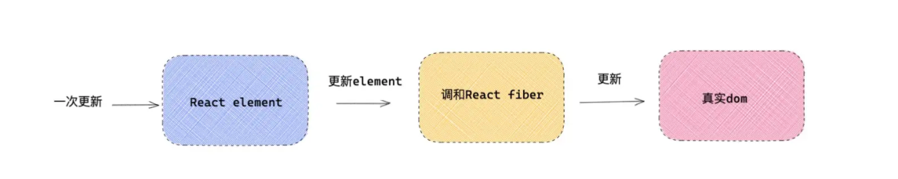
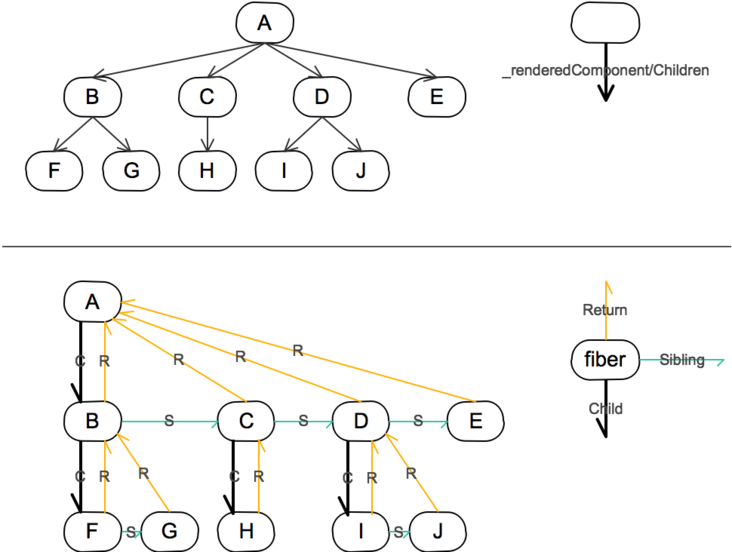
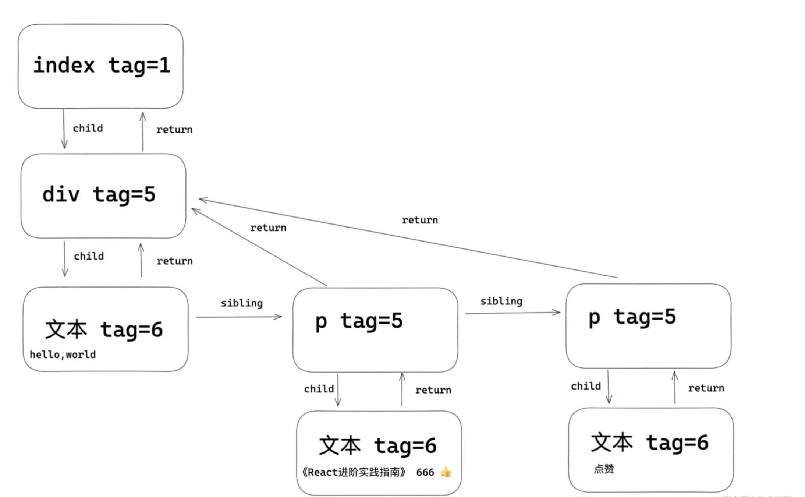

<!--
 * @Author: zhaiyingying001
 * @Date: 2021-12-05 15:05:13
 * @LastEditors: zhaiyingying001
 * @LastEditTime: 2021-12-05 16:45:58
 * @Description: 文件描述
-->
《React fiber 原理》
=========================
 <div style="text-align: right">  2021/12/05 </div>
 
# 背景
在页面元素很多，且需要频繁刷新的场景下，React 15 会出现掉帧的现象。


为什么会掉帧？

大多数的设备刷新频率是 60FPS - 换句话说，1/60 = 16.67ms，意味着每隔 16ms 一帧。这个数字非常重要，因为如果 React 渲染的时间超过 16 ms，浏览器就会丢帧。

在React决定要加载或更新一颗组件树之前，会大致做出如下一系列动作：调用各组件的生命周期函数 --> 计算和对比Virtual DOM --> 更新真实的DOM树。这个过程是同步的，也就是说，一旦这个过程开始，它就会一鼓作气跑完，一直到真实DOM树更新完毕。
由于JavaScript的单线程工作特点，业内一直有个这样的原则：任何动作都不要长时间霸占主线程，如果迟迟不归还主线程，那么在这期间程序就没法对其他输入作出响应。输入了却没有响应，或者说响应来的很慢，因此代码的运行时间需要控制在 10ms 以内。当你超过了这个预算，就会出现丢帧，动画会出现抖动, 也就是我们常常说的“卡顿”。显然，React的同步更新机制在组件树庞大时就违反了这一原则，犯了大忌。


这就是React Fiber出现的原因：为了解决旧版React视图更新的性能瓶颈。
这就是赋予更新任务的优先级非常好的一个大的原因，而不是盲目应用每次更新到调和器。另一个非常的特性是可以暂停，在下一帧恢复。这种方式 React 可以在 16ms 内更好地控制任务渲染的时间。React 团队重写了调和算法，新的算法被称为 Fiber。


# 什么是fiber
Fiber 的英文的是’纤维‘，fiber 诞生在 Reactv16 版本, 目的就是解决大型 React 应用卡顿；fiber 在 React 中是最小粒度的执行单元，无论 React 还是 Vue ，在遍历更新每一个节点的时候都不是用的真实 DOM ，都是采用虚拟 DOM ，所以可以理解成 fiber 就是 React 的虚拟 DOM 。

每一个 fiber 都可以作为一个执行单元来处理，所以每一个 fiber 可以根据自身的过期时间expirationTime（ v17 版本叫做优先级 lane ）来判断是否还有空间时间执行更新，如果没有时间更新，就要把主动权交给浏览器去渲染，做一些动画，重排（ reflow ），重绘 repaints 之类的事情，这样就能给用户感觉不是很卡。然后等浏览器空余时间，在通过 scheduler （调度器），再次恢复执行单元上来，这样就能本质上中断了渲染，提高了用户体验。


# Fiber 实现的特性

* 暂停工作，并在之后可以返回再次开始
* 可以为不同类型的工作设置优先级
* 复用之前已经完成的工作
* 终止已经不再需要的工作

# 全面认识Fiber

源码： `packages/react-reconciler/src/ReactFiber.new.js`

React 框架内部的运作可以分为 3 层：

Virtual DOM 层，描述页面长什么样。

Reconciler 层，负责调用组件生命周期方法，进行 Diff 运算等。 

Renderer 层，根据不同的平台，渲染出相应的页面，比较常见的是 ReactDOM 和 ReactNative。

这次改动最大的当属 Reconciler 层了，React 团队也给它起了个新的名字，叫Fiber Reconciler。这就引入另一个关键词：Fiber。

因此Virtual DOM、Dom diff、Fiber、Renderer等之间并不是独立的概念！而是相互关联，相辅相成的！

## element,fiber,dom三种什么关系？

element 是 React 视图层在代码层级上的表象，也就是开发者写的 jsx 语法，写的元素结构，都会被创建成 element 对象的形式。上面保存了 props ， children 等信息。

DOM 是元素在浏览器上给用户直观的表象。

fiber 可以说是是 element 和真实 DOM 之间的交流枢纽站，一方面每一个类型 element 都会有一个与之对应的 fiber 类型，element 变化引起更新流程都是通过 fiber 层面做一次调和改变，然后对于元素，形成新的 DOM 做视图渲染。



## workTag --- element 与 fiber 关联

源码： `packages/react-reconciler/src/ReactWorkTags.js`

```js
export const FunctionComponent = 0; // 对应函数组件
export const ClassComponent = 1;  // 对应的类组件
export const IndeterminateComponent = 2; // 初始化的时候不知道是函数组件还是类组件 
export const HostRoot = 3; // Root Fiber 可以理解为跟元素 ， 通过reactDom.render()产生的根元素
export const HostPortal = 4; // 对应  ReactDOM.createPortal 产生的 Portal
export const HostComponent = 5;  // dom 元素 比如 <div>
export const HostText = 6; // 文本节点
export const Fragment = 7;  // 对应 <React.Fragment> 
export const Mode = 8; // 对应 <React.StrictMode> 
export const ContextConsumer = 9; // 对应 <Context.Consumer>
export const ContextProvider = 10; // 对应 <Context.Provider>
export const ForwardRef = 11;  // 对应 React.ForwardRef
export const Profiler = 12;  // 对应 <Profiler/ >
export const SuspenseComponent = 13; // 对应 <Suspense>
export const MemoComponent = 14;  // 对应 React.memo 返回的组件
export const SimpleMemoComponent = 15;
export const LazyComponent = 16;
export const IncompleteClassComponent = 17;
export const DehydratedFragment = 18;
export const SuspenseListComponent = 19;
export const ScopeComponent = 21;
export const OffscreenComponent = 22;
export const LegacyHiddenComponent = 23;
export const CacheComponent = 24;
```

## Fiber 树 --- fiber 与 dom 关联

Fiber Reconciler在阶段一时进行Diff计算的时候，会生成一棵Fiber树。这棵树是在Virtual DOM树的基础上增加额外的信息来生成的，它本质上来说是一个链表。一个 fiber 节点就代表一个栈帧，但是也代表一个 React 组件的一个实例。一个 fiber 节点有下列成员组成：

```js
function FiberNode() {
  ...
  this.tag = tag;  // fiber 标签 证明是什么类型fiber。
  this.key = key; // key调和子节点时候用到。 
  this.type = null; // dom元素是对应的元素类型，比如div，组件指向组件对应的类或者函数。  
  this.stateNode = null;  // 节点实例

  // Fiber
  this.return = null; // 指向父级 Fiber 节点。
  this.child = null; // 指向子 Fiber 节点。
  this.sibling = null; // 指向兄弟 fiber 节点。
  this.index = 0;                  // 索引

  this.ref = null; // ref指向，ref函数，或者ref对象。

  ...
}

```


比如项目中元素结构是这样的：

```js
export default class Index extends React.Component{
   state={ number:666 } 
   handleClick=()=>{
     this.setState({
         number:this.state.number + 1
     })
   }
   render(){
     return <div>
       hello，world
       <p > 《React进阶实践指南》 { this.state.number } 👍  </p>
       <button onClick={ this.handleClick } >点赞</button>
     </div>
   }
}
```
fiber对应的关系如下



# 参考文档
* [React Fiber原理解析](https://juejin.cn/post/6844904202267787277)

* [React Fiber 原理介绍](https://segmentfault.com/a/1190000018250127)

