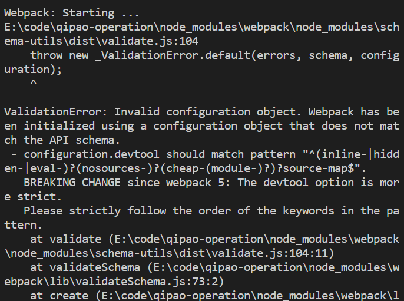
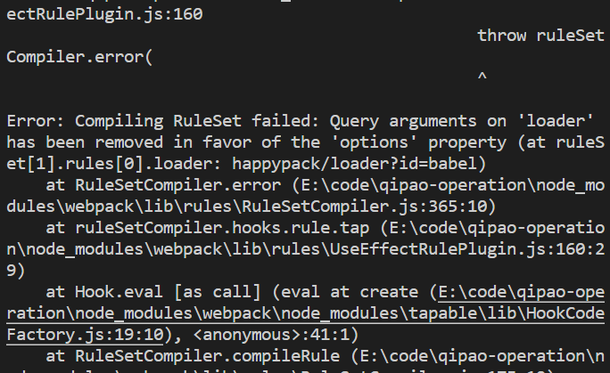
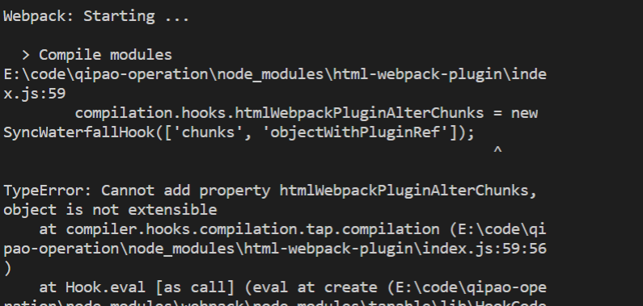

webpack 4 升 webpack5 升级初体验
==========
 <div style="text-align: right">  2020/10/13 </div>

 # 升级 webpack 以及它的依赖 
将 webpack 4 升级到最新的可用版本
`npm update webpack`


devtool: 'cheap-module-eval-source-map', ==>     devtool: 'cheap-module-source-map',

```
{
    test: /\.(eot|svg|ttf|woff|woff2)(\?\S*)?$/,
    loader: 'url-loader'
}, 

---------------------------
改为
{
    test: /\.(eot|svg|ttf|woff|woff2)(\?\S*)?$/,
    use: 'url-loader'
}
```

升级htmlwebpackPlugin 版本
```
Webpack: Starting ...

  > Compile modules
E:\code\qipao-operation\node_modules\html-webpack-plugin\lib\compiler.js:341
    const timestamp = fileTimestamps.get(fileDependency);
                                     ^

TypeError: Cannot read property 'get' of undefined
    at childCompiler.fileDependencies.some (E:\code\qipao-operation\node_modules\html-webpack-plugin\lib\compiler.js:341:38)
    at Array.some (<anonymous>)
```
mini-css-extract-plugin is broken because mainTemplate.hooks.requireEnsure is removed from webpack 5, Wondering what's your plan with mini-css-extract-plugin.
 # 参考文章
 [webpack 5 官方文档](https://webpack.docschina.org/migrate/5/)