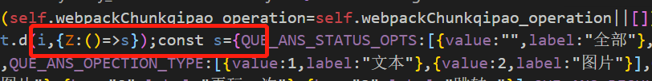

webpack 4 升 webpack5 升级初体验
==========
 <div style="text-align: right">  2020/10/13 </div>

 # 升级 webpack 以及它的依赖 
将 webpack 4 升级到最新的可用版本
`npm update webpack`


devtool: 'cheap-module-eval-source-map', ==>     devtool: 'cheap-module-source-map',


```
{
    test: /\.(eot|svg|ttf|woff|woff2)(\?\S*)?$/,
    loader: 'url-loader'
}, 

---------------------------
改为
{
    test: /\.(eot|svg|ttf|woff|woff2)(\?\S*)?$/,
    use: 'url-loader'
}
```


升级htmlwebpackPlugin 版本

```js
Webpack: Starting ...

  > Compile modules
E:\code\qipao-operation\node_modules\html-webpack-plugin\lib\compiler.js:341
    const timestamp = fileTimestamps.get(fileDependency);
                                     ^

TypeError: Cannot read property 'get' of undefined
    at childCompiler.fileDependencies.some (E:\code\qipao-operation\node_modules\html-webpack-plugin\lib\compiler.js:341:38)
    at Array.some (<anonymous>)
```

mini-css-extract-plugin is broken because mainTemplate.hooks.requireEnsure is removed from webpack 5, Wondering what's your plan with mini-css-extract-plugin.

## compiler.plugin is not a function

```
 throw err;
                                ^

TypeError: compiler.plugin is not a function
    at FasterUglifyPlugin.apply (E:\code\qipao-operation\node_modules\webpack-parallel-uglify-plugin\index.js:27:12)
    at createCompiler (E:\code\qipao-operation\node_modules\webpack\lib\webpack.js:71:12)
    at create (E:\code\qipao-operation\node_modules\webpack\lib\webpack.js:115:15)
```
之前
```js
plugins: [
    new UglifyPlugin()
]
```

修改为
```js
 optimization: {
        minimize: true,
        minimizer: [new UglifyPlugin()]
 }
```
### CleanWebpackPlugin is not a constructor

```
ypeError: CleanWebpackPlugin is not a constructor
    at Object.getPlugins (E:\code\qipao-operation\config\util.js:37:9)
    at Object.<anonymous> (E:\code\qipao-operation\config\webpack.base.js:6:22)
    at Module._compile (internal/modules/cjs/loader.js:689:30)
    at Object.Module._extensions..js (internal/modules/cjs/loader.js:700:10)
    at Module.load (internal/modules/cjs/loader.js:599:32)
    at tryModuleLoad (internal/modules/cjs/loader.js:538:12)
    at Function.Module._load (internal/modules/cjs/loader.js:530:3)
    at Module.require (internal/modules/cjs/loader.js:637:17)
    at require (internal/modules/cjs/helpers.js:22:18)
    at Module._compile (internal/modules/cjs/loader.js:689:30)
    at Object.Module._extensions..js (internal/modules/cjs/loader.js:700:10)
    at Module.load (internal/modules/cjs/loader.js:599:32)
```

`const CleanWebpackPlugin = require('clean-webpack-plugin')`

 更改为

`const { CleanWebpackPlugin } = require('clean-webpack-plugin')`

升级 webpack 5 以及 loader plugin 等插件升级之后，很多属性的引入改成以上方式

### Invalid options object
```
[webpack-cli] { ValidationError: Invalid options object. Copy Plugin has been initialized using an options object that does not match the API schema.
 - options[0] misses the property 'patterns'. Should be:
   [non-empty string | object { from, to?, context?, globOptions?, filter?, toType?, force?, flatten?, transform?, cacheTransform?, 
transformPath?, noErrorOnMissing? }, ...] (should not have fewer than 1 item)
```
查看官方文档，正确使用方式 https://webpack.docschina.org/plugins/copy-webpack-plugin/

### const => 未转译成es5 


webpack5新增environment 属性，控制打包文件是否转译

```
output: {
        environment: {
            const: false, // 是否支持const
            arrowFunction: false, // 是否支持箭头函数
            destructuring: false // 是否支持解构
        }
    }
```
配置好在看打包生效
 # 参考文章
 [webpack 5 官方文档](https://webpack.docschina.org/migrate/5/)