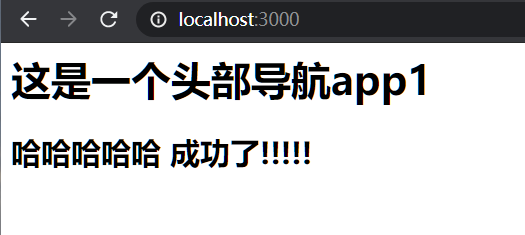

webpack 5 ModuleFederationPlugin vue 项目初体验
==========
 <div style="text-align: right">  2020/10/14 </div>

 # 背景
 前端应用、微服务的发展，使得模块化的概念越来越重要。
 这也不可避免的会产生再不同的项目会有很多功能相似，甚至完全相同。所以跨应用的代码共享尤为重要，之前我们处理这种问题往往采用，
 
 1、ctrl + v 大法好，不用费脑力直接复用。但这样就会导致项目中代码的复用性低，代码冗余多等问题出现。

 2、微服务的出现，很多业务一般使用npm 发布的形式管理公共包。npm 比较适合对业务逻辑耦合小，完全工具类的包。而对于业务逻辑比较繁重，更新频繁的模块，npm 包使用就会存在迭代需要更新版本的问题。
 并且 npm 包对于业务代码的拆分有工作量，维护成本相对较大，代码有一定质量要求，否则就会导致模块过大的问题。

 3、Module Federation 解决了跨应用代码共享的问题

 # 什么是 Module Federation
Module federation，直译很多文章中叫模块联邦，总觉的这个名字不是很好理解，这里我们暂且就不做翻译，直接用Module federation。

Module federation 使 JavaScript 应用得以从另一个 JavaScript 应用中动态地加载代码 —— 同时共享依赖。通过细化功能模块、组件复用、共享第三方库、runtime dependencies线上加载npm包等，可以更好的服务于多页应用、微前端等开发模式。

# 如何使用 ModuleFederationPlugin 
Module Federation 整体是通过ModuleFederationPlugin这个插件串联起来的。

配置示例

```js
 new ModuleFederationPlugin({
    filename: "remoteEntry.js",
    name: "app1",
    library: { type: "var", name: "app1" },
    exposes: {
        './Header': "./src/components/Header.vue",
    },
    remotes: {
        app1: "app2@http://localhost:3000/remoteEntry.js",
    },
    shared: ['vue']
})
```
配置属性：

* name，必须，唯一 ID，作为输出的模块名，使用的时通过 ${name}/${expose} 的方式使用；
* library，必须，其中这里的 name 为作为 umd 的 name；
* remotes，可选，作为引用方最关键的配置项，用于声明需要引用的远程资源包的名称与模块名称，作为 Host 时，去消费哪些 Remote；
* exposes，可选，表示作为 Remote 时，export 哪些属性被消费；
* shared，可选
    1. 若是配置了这个属性。webpack在加载的时候会先判断本地应用是否存在对应的包，若是不存在，则加载远程应用的依赖包。
    2. 以app1来讲，由于它是一个远程应用，配置了["vue"] ，而它被app1所消费，因此webpack会先查找app1是否存在这个包，若是不存在就使用app2自带包。 app2(app2 之后会以案例的形式展现)里面一样申明了这两个参数，由于app2是本地应用，因此会直接用app2的依赖
在引用远程资源的项目中使用时，需要先远程资源入口文件引入，可以异步加载，也可以使用script标签引入。

项目构建之后的产物


* main.js，应用主文件；
* remoteEntry.js，作为 remote 时被引的文件；
* src_components_Header_vue.js 异步加载的文件，main.js 或 remoteEntry.js 里可能加载的文件；

# vue 项目案例

[完整案例github](https://github.com/zhaiyy/vue-webpack5)

## 创建两个项目
我们简单创建两个项目 app1, app2，两个项目均为webpack 5 构建，vue 架构

项目目录


## 创建公共组件

现在我们在app1 src/components 目录下创建一个Header 组件
```js
<template>
    <div>
        <h1>这是一个头部导航{{name}}</h1>
        <h2>哈哈哈哈哈 成功了!!!!!</h2>
    </div>
</template>
<script>
export default {
    props: {
        name: {
            type: String,
            default: ''
        }
    }
}
</script>
```
## app1 引入组件
app1 的app.vue 引入此组件
```JS
<template>
  <div id="app">
    <Header name="app1"/>
  </div>
</template>
<script>
import Header from './components/Header.vue'
export default {
  components: {
    Header
  }
}
```
运行页面我们可以看到 



接下来我们如何在app2应用中直接使用这个Header 组件？

## app1 导出组件

首先我们现在app1中export 出此组件
```js
module.exports = {
...
    plugins: [
        ...
        new ModuleFederationPlugin({
            // 提供给其他服务加载的文件
            filename: "remoteEntry.js",
            // 唯一ID，用于标记当前服务
            name: "app1",
            library: { type: "var", name: "app1" },
            // 需要暴露的模块，使用时通过 `${name}/${expose}` 引入
            exposes: {
                './Header': "./src/components/Header.vue",
            }
          })
      ]
      ...
}
```
重新启动app1,我们直接访问 http://localhost:3000/remoteEntry.js


访问到及配置成功

## app2 引入app1模块
```js
module.exports = {
...
    plugins: [
        ...
        new ModuleFederationPlugin({
          name: "app2",
          remotes: {
            app1: "app1@http://localhost:3000/remoteEntry.js",
          }
        })
      ]
      ...
}
```
## app2 引入当前组件
app2 app.vue 引入app1 的Header 组件
```js
<template>
  <div id="app">
      <Header name="app2"/>
  </div>
</template>
<script>

export default {
  components: {
    Header: () => import('app1/Header')
  }
}
</script>
```
远程组件的引入**一定要注意代码的异步**，可以直接使用上面的异步组件的加载方式，也可以使用 async/await 方式 动态加载组件。

现在我们看一下app2的页面效果


是不是配置很简单，是不是真香

# 实现流程
app1 与app2 都有自己独有的modules, 所以实现的关键就是两个项目的modules 是如何同步，或者说app1中的组件是如何注入app2 中的。那我们你就来看一下Module federation 是如何实现的。

我们首先看一下app2 访问时的文件是如何请求的。


我们看一下app2 中的main.js 是如何引入app1 的。
```js
"use strict";
var error = new Error();
module.exports = new Promise((resolve, reject) => {
	if(typeof app1 !== "undefined") return resolve();
	__webpack_require__.l("http://localhost:3000/remoteEntry.js", (event) => {
		if(typeof app1 !== "undefined") return resolve();
		var errorType = event && (event.type === 'load' ? 'missing' : event.type);
		var realSrc = event && event.target && event.target.src;
		error.message = 'Loading script failed.\n(' + errorType + ': ' + realSrc + ')';
		error.name = 'ScriptExternalLoadError';
		error.type = errorType;
		error.request = realSrc;
		reject(error);
	}, "app1");
}).then(() => app1);

```
导出了一个异步函数，去请求了我们配置的app1 的入口文件，获取到remoteEntry.js 返回参数

接下来看一下app1/remoteEntry.js 
```js
var app1;app1 =
/******/ (() => { // webpackBootstrap
/******/ 	"use strict";
/******/ 	var __webpack_modules__ = ({

/***/ "webpack/container/entry/app1":
/*!***********************!*\
  !*** container entry ***!
  \***********************/
/*! unknown exports (runtime-defined) */
/*! runtime requirements: __webpack_require__.d, __webpack_require__.o, __webpack_exports__, __webpack_require__.e, __webpack_require__, __webpack_require__.* */
/***/ ((__unused_webpack_module, exports, __webpack_require__) => {

var moduleMap = {
	"./Header": () => {
		return __webpack_require__.e("src_components_Header_vue").then(() => () => (__webpack_require__(/*! ./src/components/Header.vue */ "./src/components/Header.vue")));
	}
};
var get = (module, getScope) => {
	__webpack_require__.R = getScope;
	getScope = (
		__webpack_require__.o(moduleMap, module)
			? moduleMap[module]()
			: Promise.resolve().then(() => {
				throw new Error('Module "' + module + '" does not exist in container.');
			})
	);
	__webpack_require__.R = undefined;
	return getScope;
};
var init = (shareScope, initScope) => {
	if (!__webpack_require__.S) return;
	var oldScope = __webpack_require__.S["default"];
	var name = "default"
	if(oldScope && oldScope !== shareScope) throw new Error("Container initialization failed as it has already been initialized with a different share scope");
	__webpack_require__.S[name] = shareScope;
	return __webpack_require__.I(name, initScope);
};

// This exports getters to disallow modifications
__webpack_require__.d(exports, {
	get: () => get,
	init: () => init
});
...
```
此文件中定义了app1 的全局变量，这边变量导出了两个方法，git, init
当我们请求app1/Header 时调用get 方法异步请求了文件名为src_components_Header_vue的文件。

src_components_Header_vue.js 此为Header 组件的一个webpack chunk 包文件，可运行在浏览器中

```js
...
"use strict";
__webpack_require__.r(__webpack_exports__);
/* harmony export */ __webpack_require__.d(__webpack_exports__, {
/* harmony export */   "render": () => /* binding */ render,
/* harmony export */   "staticRenderFns": () => /* binding */ staticRenderFns
/* harmony export */ });
var render = function() {
  var _vm = this
  var _h = _vm.$createElement
  var _c = _vm._self._c || _h
  return _c("div", [
    _c("h1", [_vm._v("这是一个头部导航" + _vm._s(_vm.name))]),
    _vm._v(" "),
    _c("h2", [_vm._v("哈哈哈哈哈 成功了!!!!!")])
  ])
}
...
```
通过上述我们可以简单总结，跨项目代码共享，要求需要共享的项目代码根据配置文件的导出模块，进行单独打包，生成对应的modules,然后通过一个全局变量建立起两个不同项目之间的连接。
# 适用范围
适用于新建专门的组件应用服务来管理全部组件和应用，其余业务层只须要根据本身业务所需载入对应的组件和功能模块便可。

模块管理统一管理，代码质量高，搭建速度快。
特别适用矩阵app，或者可视化页面搭建等场景。
（本地应用和远程应用的技术栈和版本必须兼容，统一用同一套。）
 # 参考文章
 [webpack 5 官方文档](https://webpack.docschina.org/migrate/5/)

 [探索webpack5新特性Module-federation](https://juejin.im/post/6844904133837717511)

 [Webpack 5 Module Federation: JavaScript 架构的变革者](https://zhuanlan.zhihu.com/p/120462530)
