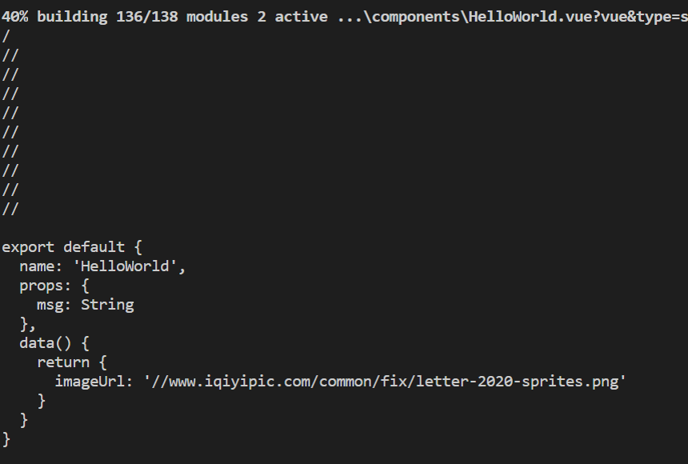
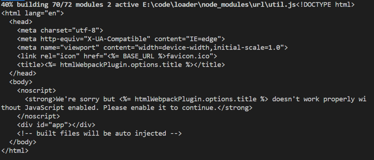
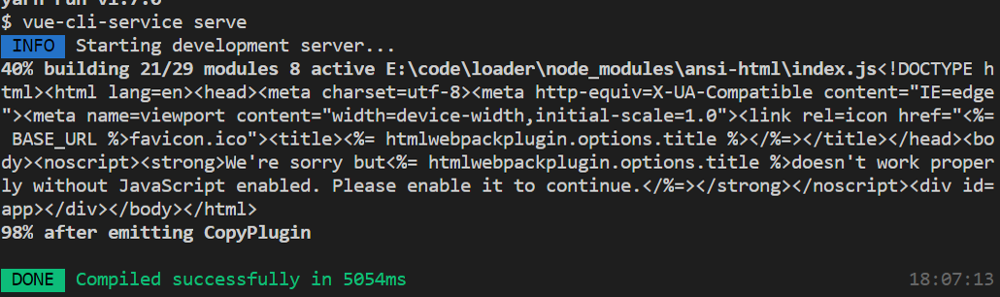
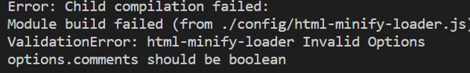

如何开发 Webpack loader
=========================
 <div style="text-align: right">  2020/7/9 </div>
 
# 前言

webpack 能把左侧各种类型的文件（webpack 把它们叫作「模块」）统一打包为右边被通用浏览器支持的文件
# 什么是 Loader ？
所谓 loader 只是一个导出为函数的 JavaScript 模块，是集成到webpack的文件处理方法，这些loader在webpack打包过程中，可以对指定类型的文件进行相应的处理，比如把less语法转换成浏览器可以识别的css语法，引入特定类型的文件（html），在js 模块直接import css 文件等等。
```javascript
module.exports = { 
    module: { 
        rules: [ 
            { test: /\.less$/, use: [‘style-loader’, ‘less-loader’] }, 
            { test: /\.ts$/, use: 'ts-loader' } 
        ]
    }
 }; 

```
# Loader的用法准则
* 单一职责，一个loader只做一件事情，这样设计的原因是因为，职责越单一，组合性就强，可配置性就好。
* 从右到左，链式执行，上一个loader的处理结果传给下一个loader接着处理
* 模块化，一个loader就是一个模块，单独存在不依赖其他的任何模块
* 在多次模块的转化之间，我们不应该在 loader 中保留状态。每个 loader 运行时应该确保与其他编译好的模块保持独立。
* 利用 loader-utils 包，提供了很多工具，最常用的获取传入 loader 的 options。除了 loader-utils 之外包还有 schema-utils 包，我们可以用 schema-utils 提供的工具，获取用于校验 options 的 JSON Schema 常量，从而校验 loader options
# Loader-基本用法
loader 是导出为一个函数的 node 模块。该函数在 loader 转换资源的时候调用。给定的函数将调用 loader API，并通过 this 上下文访问。
如下文，我们写一个空的 loader, 
```javascript
// first-loader.js
module.exports = function(source) {
   // 处理 source ...
   console.log(source)
   return source;
};

```
第一个 loader 的传入参数只有一个source： 资源文件(resource file)的内容

第一个loader 引入实例

```javascript
rules: [
           {
              test: /\.js$/,
              use: [{
                    //这里写 loader 名即可
              loader: path.resolve(__dirname, './config/first-loader.js'), 
              options: {/* ... */}
                }]
            }
	]

```
控制台运行结果

# Loader-链式操作
loader支持链式调用
```javascript
 module: {
            rules: [
             {
                test: /\.js$/,
                use: ['third-loader', 'second-loader', 'first-loader']
            }
          ]
        },
        resolveLoader: {
            // 告诉 webpack 该去那个目录下找 loader 模块
            modules: ['node_modules', path.resolve(__dirname, 'config')]
        }

```
Webpack 规定 use 数组中 Loader 的执行顺序是从最后一个到第一个，它们符合下面这些规则：
* 顺序最后的 Loader 第一个被调用，它拿到的参数是 source 的内容
* 顺序第一的 Loader 最后被调用， Webpack 期望它返回 JS 代码
```javascript
// 处理顺序排在最后的 loader 
module.exports = function (source) { 
// 这个 loader 的功能是把源模块转化为字符串交给 require 的调用方 
      return 'module.exports = ' + JSON.stringify(source); 
} 

```
* 夹在中间的 Loader 被链式调用，他们拿到上个 Loader 的返回值，为下一个 loader 提供输入。
```javascript
module.exports = function (source) { 
// 处理 source ... 
     this.callback(null, handledSource) 
     return handledSource; 
} 

```
如果是单个处理结果，可以在同步模式中直接返回。如果有多个处理结果，则必须调用 this.callback() 
```javascript
this.callback( 
    err: Error | null, 
    content: string | Buffer, 
    sourceMap?: SourceMap, 
    meta?: any 
); 

```
    第一个参数必须是 Error 或者 null
    第二个参数是一个 string 或者 Buffer。
    可选的：第三个参数必须是一个可以被这个模块解析的 source map。
    可选的：第四个选项，会被 webpack 忽略，可以是任何东西（例如一些元数据）。

# Loader开发
简单写一个html 压缩loader
```javascript
var Minimize = require('minimize');
var loaderUtils = require('loader-utils');
module.exports = function(source) {
    var options = loaderUtils.getOptions(this) || {};
    var minimize = new Minimize(options);
    return minimize.parse(source);
};

```
引用方式
```javascript
rules: [
         {
            test: /\.html$/,
            use: ['html-loader',
              {
                loader: 'html-minify-loader',
                options: {
                  comments: false
                }
              }
             ]
       }
]
w
```
运行结果



## Loader开发进阶-异步
 loader 写成异步的方式，这样不会阻塞其他编译进度。在异步模式中，必须调用 this.async()，来指示 loader runner 等待异步结果，它会返回 this.callback() 回调函数，随后 loader 必须返回 undefined 并且调用该回调函数。 
```javascript
var Minimize = require('minimize');
var loaderUtils = require('loader-utils');
module.exports = function(source) {
    var callback = this.async();
    var options = loaderUtils.getOptions(this) || {};
    var minimize = new Minimize(options);
    return callback(null, minimize.parse(source));
};

```
## Loader开发进阶-缓存
Webpack Loader 同样可以利用缓存来提高效率，并且只需在一个可缓存的 Loader 上加一句 this.cacheable(); 
默认情况下，loader 的处理结果会被标记为可缓存。调用这个方法然后传入 false，可以关闭 loader 的缓存。
```javascript
module.exports = function(source) {
    var callback = this.async();
    if (this.cacheable) {
        this.cacheable();
    }
    var options = loaderUtils.getOptions(this) || {};
    var minimize = new Minimize(options);
    return callback(null, minimize.parse(source));
};

```
## Loader开发进阶-校验传入的options
我们可以用 schema-utils 提供的工具，获取用于校验 options 的 JSON Schema 常量，从而校验 loader options。

validate()第一个参数是校验的json 第二个参数是loader传入的options 第三个参数是当前loader的名称

当前规定 传入的options必须是一个对象 他里面的comments的值必须是一个布尔值 如果不满足要求则会报错

```javascript
const validate = require('schema-utils');
let json = {
    "type": "object",
    "properties": {
        "comments": {
            "type": "boolean",
        }
    }
}
module.exports = function(source) {
    var callback = this.async();
    if (this.cacheable) {
        this.cacheable();
    }
    var options = loaderUtils.getOptions(this) || {};
    const isValid= validate(json, options, 'html-minify-loader');
    if(isValid) {
        var minimize = new Minimize(options);
        return callback(null, minimize.parse(source));
    } else {
        return callback(new Error('options 参数配置错误'))
    }
};

```
## Loader开发进阶-善用this
Loader API 将提供给每一个 Loader 的 this 中，API 可以让我们的调用方式更加地方便，更加灵活。 
this.context：当前处理文件的所在目录，假如当前 Loader 处理的文件是 /src/main.js，则 this.context 就等于 /src。
this.resource：当前处理文件的完整请求路径，包括 querystring，例如 /src/main.js?name=1。
this.resourcePath：当前处理文件的路径，例如 /src/main.js。
this.resourceQuery：当前处理文件的 querystring。
this.loadModule：但 Loader 在处理一个文件时，如果依赖其它文件的处理结果才能得出当前文件的结果时， 就可以通过 this.loadModule(request: string, callback: function(err, source, sourceMap, module)) 去获得 request 对应文件的处理结果。
……
https://www.webpackjs.com/api/loaders/#this-callback

# 项目体验
开发一个loader，把后缀位 .webp 文件转换成 .png
```JAVASCRIPT
const WEBP_REGEX = /\.webp$/i
const WEBP_IMAGE_REGEX= /(https?)?\/\/[-A-Za-z0-9+&@#\\/%?=~_|!:,.;]+[-A-Za-z0-9+&@#/%=~_|].webp/i
function replaceWebp (url, isDynamic, suffix) {
    let suf = suffix || (isDynamic ? '.gif' : '.png')
    return url.replace(WEBP_REGEX, suf)
  }
  
module.exports = function(source) {
    const callback = this.async()
    if (this.cacheable) {
        this.cacheable();
    }
    const imageReg = WEBP_IMAGE_REGEX.exec(source)
    if(imageReg) {
        const [url] = imageReg
        source = source.replace(url, replaceWebp(url))
    }
    return callback(null, source)
};

```
# 参考文档
  * http://www.weqianduan.com/2018/09/26/style-loader-and-css-loader/
  * https://juejin.im/post/5accd3aa6fb9a028dd4e91d3
  * http://www.alloyteam.com/2016/01/webpack-loader-1/
