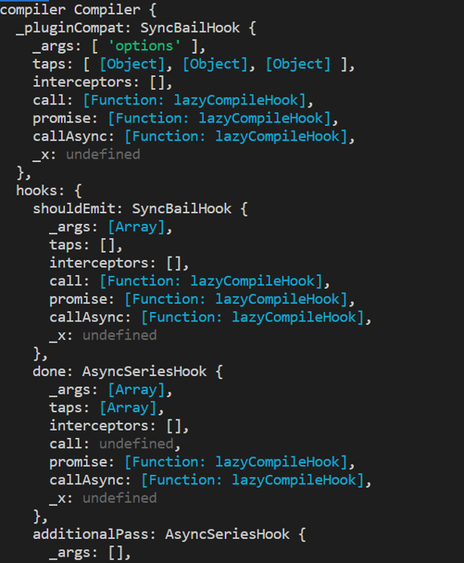
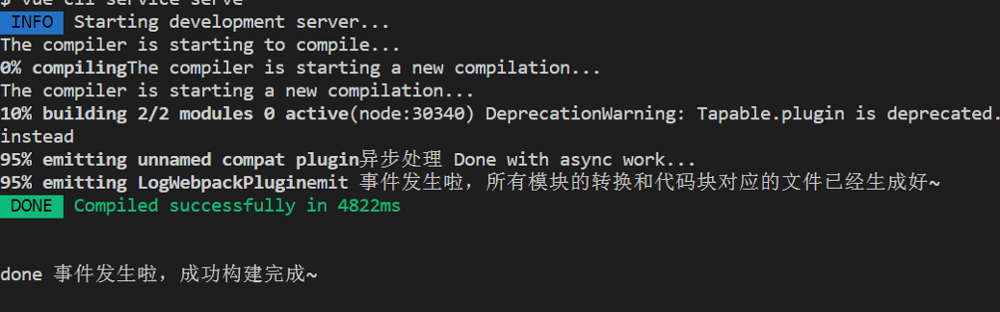
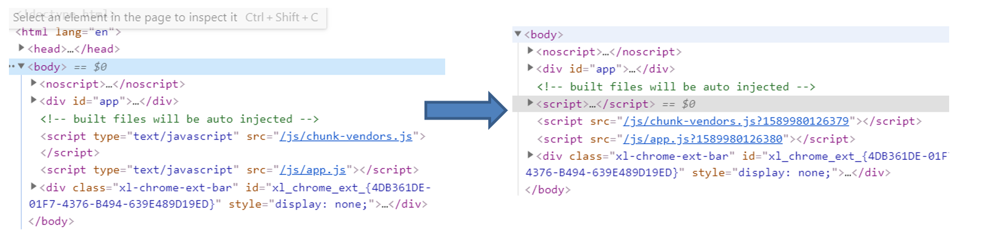
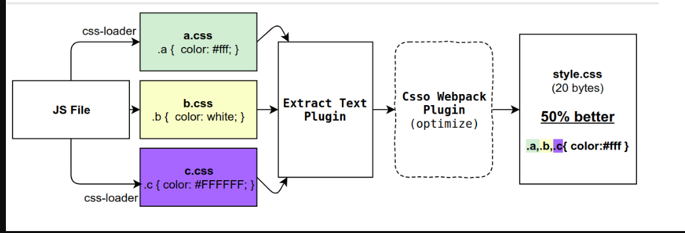
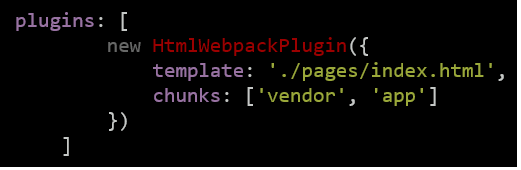
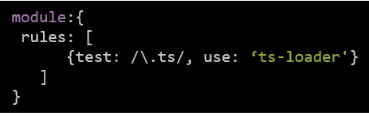

如何开发 Webpack Plugin 
=========================
 <div style="text-align: right">  2020/11/3 </div>
 
# 前言


webpack 可以看作是基于事件流的编程实现，其核心概念便是插件机制了，webpack 自身便是利用这套机制构建出来的，你可以将其看成一个插件集合。

webpack 能把左侧各种类型的文件（webpack 把它们叫作「模块」）统一打包为右边被通用浏览器支持的文件

# Loader 回顾
loader在webpack打包过程中，可以对指定类型的文件进行相应的处理，单一职责、从右到左，链式执行、模块化
```javascript
// first-loader.js
module.exports = function(source) {
   // 处理 source ...
   console.log(source)
   return source;
};

```

```javascript
 module: {
            rules: [
                {
                test: /\.js$/,
                use: ['third-loader', 'second-loader', 'first-loader']
            }
        ]
        },
        resolveLoader: {
            // 告诉 webpack 该去那个目录下找 loader 模块
            modules: ['node_modules', path.resolve(__dirname, 'config')]
        }


```
# 什么是 Plugin ？

插件向第三方开发者提供了 webpack 引擎中完整的能力。使用阶段式的构建回调，开发者可以引入它们自己的行为到 webpack 构建流程中。 —— webpack 中文文档
对开发者来说就是可以接触到 webpack 构建流程中的各个阶段并劫持做一些代码处理，对使用者来说则是我们可以通过各类插件实现诸如自动生成 HTML 模版 (html-webpack-plugin)、自动压缩图片 (imagemin-webpack-plugin) 等功能。
```js
module.exports =  {
      plugins: [
        new HtmlWebpackPlugin({
            template: './pages/index.html',
            chunks: ['vendor', 'app', 'element', 'common']
        }),
        new webpack.HotModuleReplacementPlugin()
    ]
}

```

# Plugin的组成
* 一个 JavaScript 命名函数,或 JavaScript 类，用于承接这个插件模块的所有逻辑；
* 在插件函数的 prototype 上定义一个 apply 方法。会在安装插件时被调用，并被 webpack compiler 调用一次；
* 指定一个绑定到 webpack 自身的事件钩子。即下文会提及的 hooks，用于特定时机处理额外的逻辑；
* 处理 webpack 内部实例的特定数据。
* 功能完成后调用 webpack 提供的回调。

# Plugin-基本用法

```js
// 一个 JavaScript 命名函数。
 function MyExampleWebpackPlugin() {

 }; 
// 在插件函数的 prototype 上定义一个 `apply` 方法。 
MyExampleWebpackPlugin.prototype.apply = function(compiler) { 
    // 指定一个挂载到 webpack 自身的事件钩子。 
    compiler.plugin('webpacksEventHook', function(compilation /* 处理 webpack 内部实例的特定数据。*/, callback) { 
    console.log("This is an example plugin!!!"); 
    // 功能完成后调用 webpack 提供的回调。
    callback();
    });
}; 

```
插件能够 钩入(hook) 到在每个编译(compilation)中触发的所有关键事件。在编译的每一步，插件都具备完全访问 compiler 对象的能力，如果情况合适，还可以访问当前 compilation 对象。

# Plugin-异步编译插件

有一些编译插件中的步骤是异步的，这样就需要额外传入一个 callback 回调函数，并且在插件运行结束时，_必须_调用这个回调函数。
```js
// 一个 JavaScript 命名函数。
function MyExampleWebpackPlugin() {
} 
// 在插件函数的 prototype 上定义一个 `apply` 方法。 
MyExampleWebpackPlugin.prototype.apply = function(compiler) {
    // 指定一个挂载到 webpack 自身的事件钩子。 
    console.log('compiler', compiler)
    compiler.plugin('done', function(compilation /* 处理 webpack 内部实例的特定数据。*/, callback) { 
        console.log("This is an example plugin!!!"); 
        // 功能完成后调用 webpack 提供的回调。
        callback();
    });
}; 
module.exports = MyExampleWebpackPlugin

```
在插件开发中最重要的两个资源就是 compiler 和 compilation 对象。理解它们的角色是扩展 webpack 引擎重要的第一步。

# Plugin-基本用法 - Compiler

compiler 对象代表了完整的 webpack 环境配置。这个对象在启动 webpack 时被一次性建立，并配置好所有可操作的设置，包括 options，loader 和 plugin。这个对象在 webpack 启动时候被实例化，它是全局唯一的，可以简单地把它理解为 webpack 实例。
为了在指定生命周期做自定义的一些逻辑处理，我们需要在 compiler 暴露的钩子上指明我们的 tap 配置，一般这由一个字符串命名和一个回调函数组成。一般来说，compile 过程中会触发如下几个钩子：[全部](https://webpack.docschina.org/api/compiler-hooks/)
* entryOption : 在 webpack 选项中的 entry 配置项 处理过之后，执行插件。
* afterPlugins : 设置完初始插件之后，执行插件。
* compilation : 编译创建之后，生成文件之前，执行插件。。
* emit : 生成资源到 output 目录之前。
* done : 编译完成
假设我们想在 compiler.run() 之前处理逻辑，那么就要调用 beforeRun 钩子来处理：

```js
compiler.hooks.beforeRun.tap('testPlugin', (comp) => {
 	// ... 
}); 

```



# Plugin-基本用法 - Compilation

compilation 对象代表了一次资源版本构建。当运行 webpack 开发环境中间件时，每当检测到一个文件变化，就会创建一个新的 compilation，从而生成一组新的编译资源。一个 compilation 对象表现了当前的模块资源、编译生成资源、变化的文件、以及被跟踪依赖的状态信息。compilation 对象也提供了很多关键时机的回调，以供插件做自定义处理时选择使用。
同样的，compilation 也对应有不同的钩子给开发者调用，具体可参见[官方文档](https://webpack.docschina.org/api/compilation-hooks/)。

`compilation.hooks.someHook.tap(/* ... */); 
`
这两个组件是任何 webpack 插件不可或缺的部分（特别是 compilation）

# Plugin-基本用法 – 事件流 

* webpack打包是一种事件流的机制，我们可以把webpack理解为一条生产线，需要经过一系列处理流程后才能将源文件转换成输出结果。
这条生产线上的每个处理流程的职责都是单一的，多个流程之间会存在依赖关系，只有完成当前处理后才能交给下一个流程去处理。
* 原理是将各个插件串联起来。

webpack的事件流机制它能保证了插件的有序性，使整个系统的扩展性好。事件流机制使用了观察者模式来实现的
```js
/*
 * 广播事件
 * myPlugin-name 为事件名称
 * params 为附带的参数
*/

compiler.apply('myPlugin-name', params);

/*
 * 监听名称为 'myPlugin-name' 的事件，当 myPlugin-name 事件发生时，函数就会执行。
*/

compiler.hooks.myPlugin-name.tap('myPlugin-name', function(params) {
  
});

```

# Plugin-基本用法 - Tapable 

那么实现这一切的核心就是tapable。

tapable 这个小型 library 是 webpack 的一个核心工具，但也可用于其他地方，以提供类似的插件接口。webpack 中许多对象扩展自 Tapable 类。这个类暴露 tap, tapAsync 和 tapPromise 方法，可以使用这些方法，注入自定义的构建步骤，这些步骤将在整个编译过程中不同时机触发。

根据所使用的 钩子(hook) 和 tap 方法，插件可以以多种不同的方式运行.
例如，当钩入 compile 阶段时，只能使用同步的 tap 方法：

```js
compiler.hooks.compile.tap('MyPlugin', params => { 
	console.log('以同步方式触及 compile 钩子。');
}) 

```

# Plugin-插件的不同类型

对于能够使用了 AsyncHook(异步钩子) 的 run，我们可以使用 tapAsync 或 tapPromise（以及 tap）：
```js
compiler.hooks.run.tapAsync('MyPlugin', (source, target, routesList, callback) => { 
	console.log('以异步方式触及 run 钩子。'); 
	callback(); 
}); 
compiler.hooks.run.tapPromise('MyPlugin', (source, target, routesList) => { 
	return new Promise(resolve => setTimeout(resolve, 1000)).then(() => { 
		console.log('以具有延迟的异步方式触及 run 钩子。'); 
	}); 
}); 
compiler.hooks.run.tapPromise('MyPlugin', async (source, target, routesList) => { 
	await new Promise(resolve => setTimeout(resolve, 1000)); 
	console.log('以具有延迟的异步方式触及 run 钩子。'); 
}); 

```
# Plugin插件-compile时机
```js
class LogWebpackPlugin {
    apply(compiler) {
        compiler.hooks.emit.tap('LogWebpackPlugin', () => {
            // 在 emit 事件中回调 emitCallback
            console.log('emit 事件发生啦，所有模块的转换和代码块对应的文件已经生成好~')
          });
          compiler.hooks.done.tap('LogWebpackPlugin', (err) => {
            // 在 done 事件中回调 doneCallback
            console.log('done 事件发生啦，成功构建完成~')
         });
          compiler.hooks.compilation.tap('LogWebpackPlugin', () => {
            // compilation（'编译器'对'编译ing'这个事件的监听）
            console.log("The compiler is starting a new compilation...")
          });
          compiler.hooks.compile.tap('LogWebpackPlugin', () => {
            // compile（'编译器'对'开始编译'这个事件的监听）
            console.log("The compiler is starting to compile...")
          });
    }
}
module.exports = LogWebpackPlugin;

```



# HtmlWebpackPlugin 介绍

HtmlWebpackPlugin 简化了 HTML 文件的创建，以便为你的 Webpack 包提供服务。这对于在文件名中包含每次会随着编译而发生变化哈希的 webpack bundle 尤其有用。

html-webapck-plugin 插件两个主要作用：
* 为 HTML 文件引入外部资源（如 script / link ）动态添加每次编译后的 hash，防止引用文件的缓存问题；
* 动态创建 HTML 入口文件，如单页应用的 index.html文件。
]

html-webapck-plugin 插件原理介绍：
* 读取 Webpack 中 entry 配置的相关入口 chunk 和 extract-text-webpack-plugin 插件抽取的 CSS 样式；
* 将样式插入到插件提供的 template 或 templateContent 配置指定的模版文件中；
* 插入方式是：通过 link 标签引入样式，通过 script 标签引入脚本文件；

# 简单实现js 添加时间戳插件
```js
// SetScriptTimestampPlugin.js

class SetScriptTimestampPlugin {
    apply(compiler) {
        /*
        entryOption : 在 webpack 选项中的 entry 配置项 处理过之后，执行插件。
        afterPlugins : 设置完初始插件之后，执行插件。
        compilation : 编译创建之后，生成文件之前，执行插件。。
        emit : 生成资源到 output 目录之前。
        done : 编译完成。
        */
        // 我们插件应该是要在 HTML 输出之前，动态添加 script 标签，所以我们选择钩入 compilation 阶段
        compiler.hooks.compilation.tap('SetScriptTimestampPlugin',
         (compilation, callback) => {
             /*
                tap 第二个参数是个回调函数，并且这个回调函数有两个参数： compilation 和 callback 。
                compilation 继承于compiler，包含 compiler 所有内容（也有 Webpack 的 options），
                而且也有 plugin 函数接入任务点。
              */

            // 插件逻辑 调用compilation提供的plugin方法
            compilation.plugin(
                "html-webpack-plugin-before-html-processing",
                function(htmlPluginData, callback) {
                  // 获取脚本文件名称列表并清空。
                  let result = ''
                  htmlPluginData.assets.js.forEach((ele,index) => {
                    // 动态创建一个 script 标签，将其 src 值设置为上一步读取到的脚本文件名
                     // 并在后面拼接 时间戳 作为参数。
                    result = result +  `
                        let scriptDOM${index} = document.createElement("script");
                        let jsScr${index} = "${ele}";
                        scriptDOM${index}.src = jsScr${index} + "?" + new Date().getTime();
                        document.body.appendChild(scriptDOM${index})
                `;
                
                  });
                  htmlPluginData.assets.js = [];                 
                 // 替换逻辑模板
                    let resultHTML = htmlPluginData.html.replace(
                    "<!--SetScriptTimestampPlugin inset script-->", `<script>${result}</script>`
                  );
                  // 返回修改后的结果
                  htmlPluginData.html = resultHTML;
                }
            )
        });
      }
  }
  module.exports = SetScriptTimestampPlugin;
  
```
打包结果


[完整体验项目](https://github.com/zhaiyy/webpack-plugin)

# Plugin 与 loader 对比



||Plugin|loader|
---|:--:|---:
|作用|执行更广泛的任务，打包前或打包后对结果进行再次操作|转换指定类型的模块，将某个语法统一处理为统一的语法
|概念|基于事件流-核心处理能够参与到compilation process的自定义函数，通过hook到每一个编译（compiler）中，触发关键事件或处理|文件转换-翻译官传入resource file 或者sourceMap json 结果，读取文件，将文件处理为String 或者 Buffer 格式，然后传给compiler 或者下一个loader.
|引入||
|开发|一个 JavaScript 命名函数,或 JavaScript 类,定义一个 apply 方法,参数 compiler，compilation|本质上为js 函数，接受参数source


# 参考文档
* [让我们来写个 webpack 插件](https://hijiangtao.github.io/2019/12/01/Introduction-of-webpack-plugin/)
* [Webpack官方文档](https://www.webpackjs.com/contribute/writing-a-plugin/#%E7%A4%BA%E4%BE%8B)
* [webpack 简单插件开发](https://juejin.im/post/5d1ec343f265da1bc94f0cb3)
* [Webpack 插件开发如此简单！](https://juejin.im/post/5e5309ece51d4526e03f9e53)

