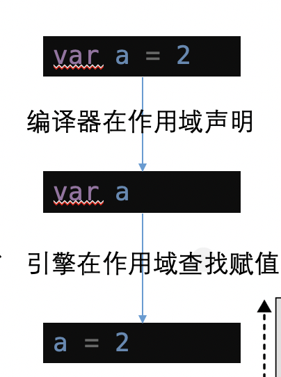

《你不知道JavaScript》 ---作用域和闭包
=========================
 <div style="text-align: right">  2021/5/20 </div>
 
# 简介
《你不知道JavaScript》 系列 读书笔记
# 作用域和闭包
## 第1章-作用域是什么
###  引擎 & 编译器 & 作用域
首先来了解一下几个概念
* 引擎：负责整个JavaScript程序的编译及执行过程。
* 编译器：负责语法分析及代码生成等脏活累活
* 作用域：负责收集并维护由所有声明的标识符（变量）组成的一系列查询，并实施一套非常严格的规则，确定当前执行的代码对这些标识符的访问权限。
* 作用域的嵌套：当一个块或函数嵌套在另一个块或函数中时，引擎从当前的执行作用域开始查找变量，如果找不到，就向上一级继续查找。当抵达最外层的全局作用域时，无论找到还是没找到，查找过程都会停止。


下面我们通过下面的语句，深入了解一下几个概念
```js
var a = 2
```

此语句过程分为两个阶段，第一个阶段编译器在作用域声明 – 查找当前作用域是否存在 a 的变量 ，存在 则忽略改声明-继续编译，不存在则会声明一个新变量-命名a 。第二个阶段引擎询问作用域 是否存在 a 如果存在则使用此变量 并赋值，否则抛出异常。
### RHS查询 & LHS查询
RHS查询：变量出现在赋值操作的右侧时进行，谁是赋值操作的源头
LHS查询：变量出现在赋值操作的左侧时进行，赋值操作的目标是谁
考虑以下代码：
`console.log(a)`
其中对a的引用是一个RHS引用，因为这里a并没有赋予任何值。
相比之下
`a = 2`
这里对a的引用则是LHS引用，因为实际上我们并不关心当前的值是什么，只是想要为=2这个赋值操作找到一个目标
看一个小🌰

首先执行一次 RHS-> foo
然后进行 LHS-> a = 2
最后 在进行 RHS-> console.log(a)

再看一个小🌰


### 为什么区分LHS和RHS
首先比较一下下面两段代码
```js
// 代码一
function foo (a) {
  console.log(a + b)
  b = a 
}
foo(2)

```
```js
// 代码二
function foo (a) {
 b = a 
 console.log(a + b) // 4
}
foo(2)

```
上面两端代码可知，在非严格模式下，第一段代码会异常

第二段代码会正常执行
原因就是因为如果RHS查询在所有嵌套的作用域中遍寻不到所需的变量，引擎就会抛出ReferenceError异常。当引擎执行LHS查询时，如果在顶层（全局作用域）中也无法找到目标变量，全局作用域中就会创建一个具有该名称的变量，并将其返还给引擎，前提是程序运行在非“严格模式”下。
## 第2章-词法作用域
定义在词法阶段的作用域。换句话说，词法作用域是由你在写代码时将变量和块作用域写在哪里来决定的。


上面的代码，可以分为下图三个词法作用域


但也存在例外，欺骗作用域
### eval

在严格模式的程序中，eval(..)在运行时有其自己的词法作用域，意味着其中的声明无法修改所在的作用域。
### with

如果with 函数里面没有做局部变量的声明，则在赋值的是否此变量会泄漏到全局作用域。
## 第3章 函数作用域和块作用域
### 函数作用域的含义
函数作用域的含义是指，属于这个函数的全部变量都可以在整个函数的范围内使用及复用（事实上在嵌套的作用域中也可以使用）

看上图的例子，foo 函数有独立的函数作用域，包含 a、b、c、bar。所以在全局作用域中直接调用 a、b、c、bar 参数会提示报错，这就是函数作用域的作用。
### 函数作用域的作用
#### 隐藏内部实现:最小授权或最小暴露原则

原有的方法，对全局暴漏了 doSomethingElse 方法以及b 变量，但是这两个目前只有doSometing 函数中使用，所以 doSomethingElse、b  无疑对全局变量存在污染。我们可以使用函数作用域的作用规避此问题

当前 doSomethingElse 方法以及b 变量仅能在doSometing 函数中调用，全局无法使用
#### 规避冲突
可以避免相同变量导致的覆盖问题

思考一个问题，如果函数不需要函数名（或者至少函数名可以不污染所在作用域），并且能够自动运行?
估计到这里各位老司机已经想到了解决办法-匿名和具名
第一种我们常见的定时器函数

当然为了方便理解以及代码的可读性，我们一可以对定时器函数添加函数名，但对函数执行是没有任何影响的。

还有一种我们常见的模式，立即执行函数，也是利用的函数作用与的特点，进行了变量的封装与隔离。


### 块作用域的含义
函数不是唯一的作用域单元。块作用域指的是变量和函数不仅可以属于所处的作用域，也可以属于某个代码块（通常指{ .. }内部）
其实在es6 出现执行对于javascrip 开发者而言，块作用域的概念是相对比较模糊，或者说没有明确概念的。
其实之前我们最使用的try..catch 方法中的catch 就是块作用域，catch 中的变量只能在catch 方法中使用，外部无法获取。

es6 之后我们我们有了`let`与`const`这两个参数进行声明变量，可以封锁当前块作用域，如下面


如下例子，b 使用let 进行定义，所以只能在if 所在的块内

