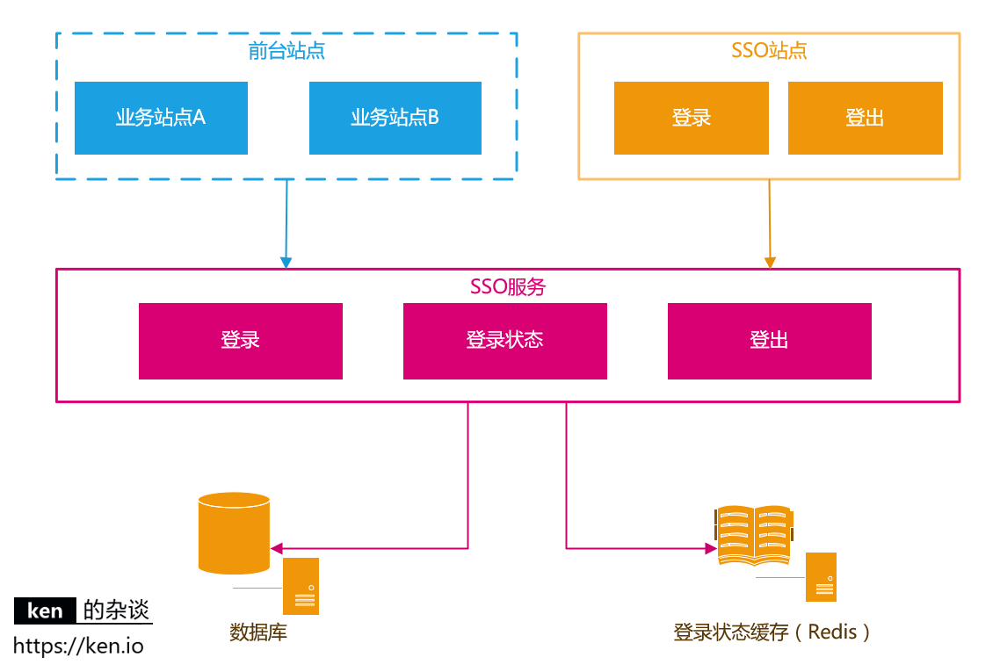
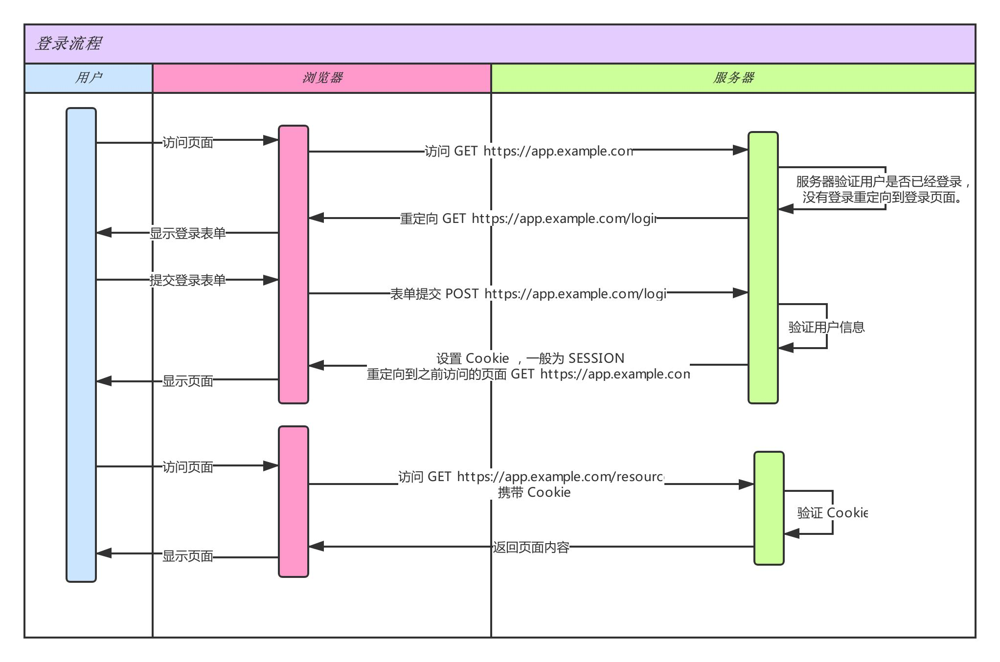
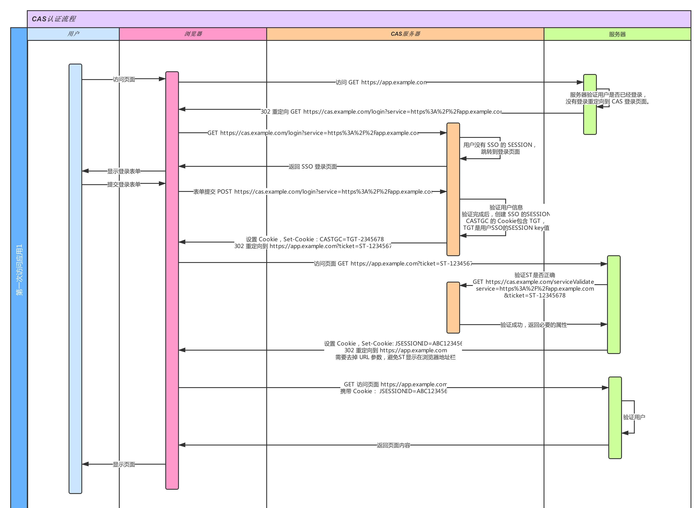
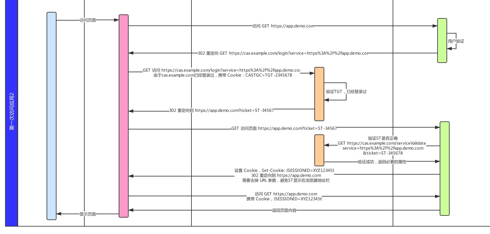
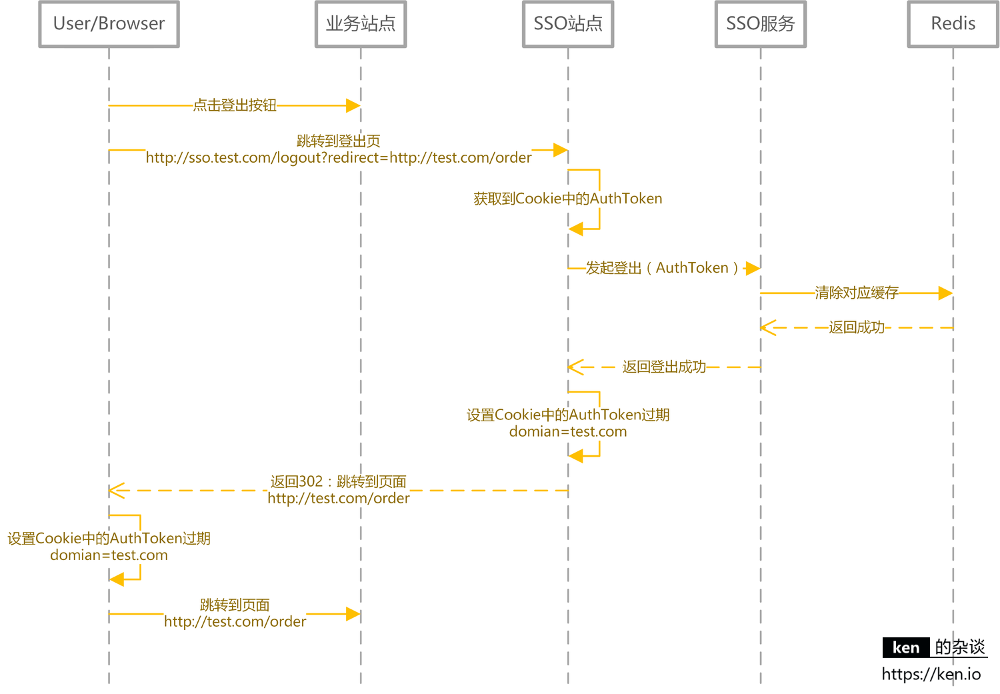

单点登录 SSO
==========
 
  2020/08/06 

 # 背景

 但随着企业的发展，用到的系统随之增多，用户在操作不同的系统时，需要多次登录，而且每个系统的账号都不一样，这对于用户来说，很不方便。于是，就想到是不是可以在一个系统登录，其他系统就不用登录了呢？这就是单点登录要解决的问题。比如 淘宝，支付宝，天猫商城等都使用单点登录，同一个账号可以登录多个系统。

 # 什么是单点登录 
 单点登录英文全称Single Sign On，简称就是SSO。是比较流行的企业业务整合的解决方案之一。 SSO的定义是在多个应用系统中，用户只需要登录一次就可以访问所有相互信任的应用系统。

 # SSO设计

基础模式 SSO 访问流程主要有以下步骤：
* 访问服务： SSO 客户端发送请求访问应用系统提供的服务资源。
* 定向认证： SSO 客户端会重定向用户请求到 SSO 服务器。
* 用户认证：用户身份认证。
* 发放票据： SSO 服务器会产生一个随机的 Service Ticket 。
* 验证票据： SSO 服务器验证票据 Service Ticket 的合法性，验证通过后，允许客户端访问服务。
* 传输用户信息： SSO 服务器验证票据通过后，传输用户认证结果信息给客户端。

 # 单系统登录
 访问一个需要登录的应用时主要发生的一系列流程，如下图所示
 
 
 登录后设置的 Cookie，之后每次访问时都会携带该 Cookie，从而让后台服务能识别当前登录用户。Cookie过期重新登录
 如果是同域下系统登录，依旧可以使用此方式进行登录

 # 不同域下的单点登录
 不同域之间Cookie是不共享的，怎么办？
 这里我们就要说一说CAS流程了，这个流程是单点登录的标准流程。
 

 ## 用户首次访问系统1 登录时序图

 
 具体流程如下：

1. 用户访问app系统，app系统是需要登录的，但用户现在没有登录。
2. 跳转到CAS server，即SSO登录系统，以后图中的CAS Server我们统一叫做SSO系统。 SSO系统也没有登录，弹出用户登录页。
3. 用户填写用户名、密码，SSO系统进行认证后，将登录状态写入SSO的session，浏览器（Browser）中写入SSO域下的Cookie。
4. SSO系统登录完成后会生成一个ST（Service Ticket），然后跳转到app系统，同时将ST作为参数传递给app系统。
5. app系统拿到ST后，从后台向SSO发送请求，验证ST是否有效。
6. 验证通过后，app系统将登录状态写入session并设置app域下的Cookie。
 ## 用户再次访问系统2 登录时序图
  
 具体流程如下：
1. 用户访问app2系统，app2系统没有登录，跳转到SSO。
2. 由于SSO已经登录了，不需要重新登录认证。
3. SSO生成ST，浏览器跳转到app2系统，并将ST作为参数传递给app2。
4. app2拿到ST，后台访问SSO，验证ST是否有效。
5. 验证成功后，app2将登录状态写入session，并在app2域下写入Cookie。
## 用户登出

用户登出时要做的事情很简单：

* 服务端清除缓存（Redis）中的登录状态
* 客户端清除存储的AuthToken
  
# Service Ticket 安全性
ST （ Service Ticket ）是通过 Http 传送的，因此网络中的其他人可以 Sniffer 到其他人的 Ticket 。 CAS 通过以下几方面来使 ST 变得更加安全（事实上都是可以配置的）：
1. ST 只能使用一次
CAS 协议规定，无论 Service Ticket 验证是否成功， CAS Server 都会清除服务端缓存中的该Ticket ，从而可以确保一个 Service Ticket 不被使用两次。
2. ST 在一段时间内失效
CAS 规定 ST 只能存活一定的时间，然后 CAS Server 会让它失效。默认有效时间为 5 分钟。
3. ST 是基于随机数生成的
ST 必须足够随机，如果 ST 生成规则被猜出， Hacker 就等于绕过 CAS 认证，直接访问 对应的服务。

# 单点登录的优缺点

## 优点
1. 提高用户的效率。 用户不再被多次登录困扰，也不需要记住多个 ID 和密码。另外，用户忘记密码并求助于支持人员的情况也会减少。

2. 提高开发人员的效率。 SSO 为开发人员提供了一个通用的身份验证框架。实际上，如果 SSO 机制是独立的，那么开发人员就完全不需要为身份验证操心。他们可以假设，只要对应用程序的请求附带一个用户名，身份验证就已经完成了。

3. 简化管理。 如果应用程序加入了单点登录协议，管理用户帐号的负担就会减轻。简化的程度取决于应用程序，因为 SSO 只处理身份验证。所以，应用程序可能仍然需要设置用户的属性（比如访问特权）。

## 缺点
1. 不利于重构 因为涉及到的系统很多，要重构必须要兼容所有的系统，可能很耗时。

2. 无人看守桌面 因为只需要登录一次，所有的授权的应用系统都可以访问，可能导致一些很重要的信息泄露。

 # 参考文章
 * [单点登录（SSO）看这一篇就够了
](https://developer.aliyun.com/article/636281)

* [单点登录（SSO）的设计与实现](https://ken.io/note/sso-design-implement)
* [CAS实现单点登录（sso）原理
](https://juejin.im/post/6844904155161559048)
* [图文并茂，为你揭开“单点登录“的神秘面纱
](https://www.zoo.team/article/sso)