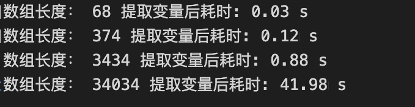
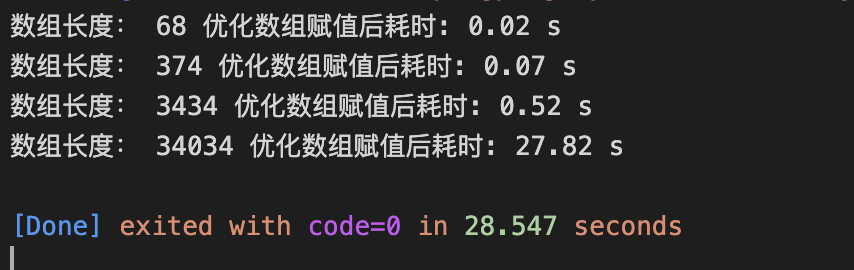
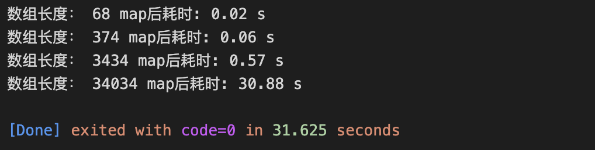
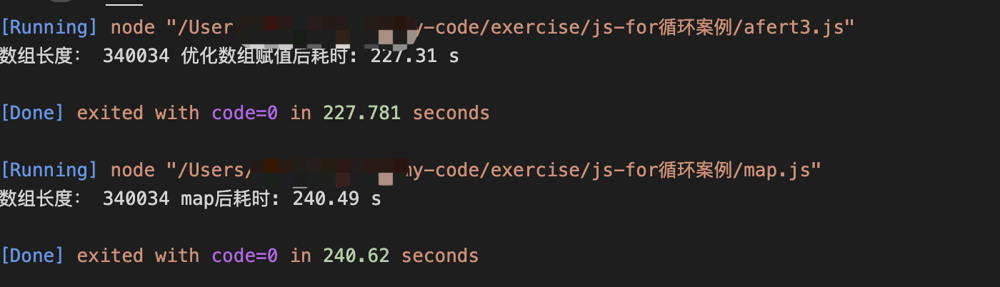

由一段for循环代码引发的对性能优化的探索
==========
 <div style="text-align: right">  2022/05/30 </div>

 # 背景
 在进行项目性能优化过程中，发现某个页面用户可交互时间较长，通过进行总体性能指标分析，页面的整体耗时在dom解析。
 
 

 dom解析耗时较长无外乎DOM操作会导致一系列的重绘（repaint）、重新排版（reflow）操作，可能原因有：
 
 1、页面dom 节点过多，DOM 节点的数量越多，构建 DOM 树所需的时间就越长
 
 2、DOM元素的添加、修改（内容）、删除( Reflow + Repaint)
 
 3、仅修改DOM元素的字体颜色
 
 4、Resize浏览器窗口、滚动页面
 
 5、读取元素的某些属性（offsetLeft、offsetTop、offsetHeight、offsetWidth、scrollTop/Left/Width/Height、clientTop/Left/Width/Height、getComputedStyle()、currentStyle(in IE)) 

# 问题
 依照上述的分析，进行了页面代码的分析回归，找到当前页面一段代码是导致dom解析耗时的罪魁祸首。代码如下：
 ```js
 const arr1 = []
for (let i = 0; i < cityData.length; i++) {
    arr1[i] = {}
    arr1[i].value = cityData[i].name
    arr1[i].label = cityData[i].name
    arr1[i].children = []

    for (let j = 0; j < cityData[i].citys.length; j++) {
      arr1[i].children[j] = {}
      arr1[i].children[j].value = cityData[i].citys[j].name
      arr1[i].children[j].label = cityData[i].citys[j].name
    }
}
 ```
这段代码的功能主要实现的功能，是针对后端返回的中国的地级市数据`{{gbCode: '110000',name: '北京',citys: [{gbCode: '110000',
name: '北京市'}]}}`进行解析转换成前端 picker 组建可使用的数据`{label:'北京',value: '北京', children:[{name:'北京市', label:'北京市'}]}`
看起来上述的代码无论从可读性还是从逻辑上并没有太大的问题，下面我们针对这对代码进行一下耗时分析。

[具体代码请参考](https://github.com/zhaiyy/exercise/blob/master/js-for%E5%BE%AA%E7%8E%AF%E6%A1%88%E4%BE%8B/before.js)

本次分析使用`performance.now()` 进行数据统计。（注：为什么使performance.now，不使用 console.time? 请看文章底部分析）

为保证数据的相对准确性，我们所有的数据均进行1000次计算并求平均值。

这段代码平均耗时： 0.31ms

|  数组长度  |  68   | 374  | 3434  | 34034 | 
|  ---- |  ----  | ----  |----  |----  |
| 优化前 | 0.03ms  | 0.12ms |  0.94ms | 46.58ms | 


# 优化 一、提取变量，设置缓存
我们通过上述代码，发现 ` cityData[i].name` 与 `cityData[i].citys[j].name`多次使用，但没有进行变量定义，会导致每次使用都从数据重新解析。我们设置一个变量，进行数据缓存。

[具体代码请参考](https://github.com/zhaiyy/exercise/blob/master/js-for%E5%BE%AA%E7%8E%AF%E6%A1%88%E4%BE%8B/after1.js)

```js
 const arr1 = []
  for (let i = 0; i < cityData.length; i++) {
    const { name, citys } = cityData[i] // name, citys 设置变量
    arr1[i] = {}
    arr1[i].value = name
    arr1[i].label = name
    arr1[i].children = []

    for (let j = 0; j < citys.length; j++) {
      const { name: childName } = citys[j] // name 设置变量
      arr1[i].children[j] = {}
      arr1[i].children[j].value = childName
      arr1[i].children[j].label = childName
    }
  }
```
|  数组长度  |  68   | 374  | 3434  | 34034 | 
|  ---- |  ----  | ----  |----  |----  |
| 提取变量后 | 0.03ms  | 0.12ms | 0.88ms | 41.98ms | 



通过与上次数据对比，设置变量进行缓存均有一定的优化效果。以数组最大长度做对比，比初始数据提高 9.87%

## 优化 二、对象直接进行赋值，不进行元素的获取在赋值
我们发现对象赋值，首先创建了一个空对象 `arr1[i] = {}`,然后进行对象属性赋值`arr1[i].value = name`，这种形式赋值value属性，会有个查找过程，当前元素查找不到还会一次顺着原型链想上一级查找，直到最顶部元素，然后进行赋值。当数据量变大这种形式相对于在创建对象一次性赋值属性更加消耗性能。因此我们修改对象创建方式,在创建对象的时候把对象的属性一起进行创建。

```js
const arr1 = []
    for (let i = 0; i < cityData.length; i++) {
      const { name, citys } = cityData[i]
      arr1[i] = {
        value: name,
        label: name,
        children: []
      }

      for (let j = 0; j < citys.length; j++) {
        const { name: childName } = citys[j]
        arr1[i].children[j] = {
          value: childName,
          label: childName
        }
      }
    }
```

接着我们修改一下citys循环中的顺序，对 arr1[i] 的 children 也进行提取后赋值,与 arr1[i]一同初始化。

[具体代码请参考](https://github.com/zhaiyy/exercise/blob/master/js-for%E5%BE%AA%E7%8E%AF%E6%A1%88%E4%BE%8B/after2.js)

```js
 const arr1 = []
  for (let i = 0; i < cityData.length; i++) {
    const { name, citys } = cityData[i]
    const children = []
    for (let j = 0; j < citys.length; j++) {
      const { name: childName } = citys[j]
      children[j] = {
        value: childName,
        label: childName
      }
    }
    arr1[i] = {
      value: name,
      label: name,
      children: children
    }
  }
```
|  数组长度  |  68   | 374  | 3434  | 34034 | 
|  ---- |  ----  | ----  |----  |----  |
| 提取变量后 | 0.02ms  | 0.07ms | 0.56ms | 34.12ms | 


此次优化完数据效果很明显，以数组最大长度做对比，比上一次优化数据提升 18.7%，比初始数据提高 26.74%。

## 优化 三、数组赋值优化
完成了对象赋值的优化，接下来我们需要对数组赋值进行优化。会有人问，数组赋值怎么优化？改成push 么？

我门可以来改成push操作了看一下数据。

```js
const arr1 = []
for (let i = 0; i < cityData.length; i++) {
  const { name, citys } = cityData[i]
  const children = []
  for (let j = 0; j < citys.length; j++) {
    const { name: childName } = citys[j]
    children.push({
      value: childName,
      label: childName
    })
  }
  arr1.push({
    value: name,
    label: name,
    children: children
  })
}
```


跟上述对比，发现数据差别并没有很明显，甚至还有增加的趋势。

那该如何进行优化？我们先进优化，然后在进行原因分析。数组赋值优化，我们只需要更改一步操作即可，把`const arr1 = []` 优化成 `const arr1 = new Array(cityData.length)` 

[具体代码请参考](https://github.com/zhaiyy/exercise/blob/master/js-for%E5%BE%AA%E7%8E%AF%E6%A1%88%E4%BE%8B/after3.js)

```js
  const arr1 = new Array(cityDataLen)
  for (let i = 0; i < cityDataLen; i++) {
    const { name, citys } = cityData[i]
    const citysLen = citys.length
    const children = new Array(citysLen)
    for (let j = 0; j < citys.length; j++) {
      const { name: childName } = citys[j]
      children[j] = {
        value: childName,
        label: childName
      }
    }
    arr1[i] = {
      value: name,
      label: name,
      children: children
    }
  }
```
|  数组长度  |  68   | 374  | 3434  | 34034 | 
|  ---- |  ----  | ----  |----  |----  |
| 提取变量后 | 0.02ms  | 0.06ms | 0.52ms | 27.82ms | 



整体优化完以数组最大长度做对比，比上一次优化数据提升 18.5%，比初始数据提高 40.27%。

当数组长度为34034时，执行耗时已经进入30ms以内

new Array(cityData.length) 与 [] 有什么区别呢？为啥这个小小的改变能够带来如此的性能提升呢？

根据 ECMA 标准，Array 初始的时候let arr = []（或者）let arr = new Array() 与 let arr = new Array(size)没有本质的区别，只是后者的数组实例的 length 的 赋值为 size。但是在写入数组的过程中，会频繁的修改数组实例的 length 属性。由于初始的内存池比较小，在频繁的修改数组length的同时发生了频繁的内存分配，因此导致了性能的损耗。

# 直接使用map耗时分析
直接使用map可以简化代码，是代码可独享更高。但众所周知，由于map操作会进行回调，并创造一个新的数组返回，占用内存而且map 还需要考虑很多极端情况，比如 getter、稀疏数组和检查传递的参数是否是数组，这会增加开销，因此在数组操作中for 循环的性能要优于map 的性能。我们进行一下数据对比

[具体代码请参考](https://github.com/zhaiyy/exercise/blob/master/js-for%E5%BE%AA%E7%8E%AF%E6%A1%88%E4%BE%8B/map.js)

```js
const arr1 = cityData.map(({ name, citys }) => {
    return {
      value: name,
      label: name,
      children: citys
        ? citys.map(({ name: childName }) => ({
            value: childName,
            label: childName
          }))
        : []
    }
  })
```


从数据上看，比for 循环结果会有细微的增大，我们把数组长度变大在对比一下



整体上还是有17ms 的差值，所以从数据上也可以印证for循环要比map的性能更高

# 结论
针对以上的优化分析，我们可得出以下几条优化方案：

1、针对可复用的变量属性进行赋值，设置缓存

2、针对 obj 减少对象元素的赋值，尽可能的在初始化的时候完成

3、针对数据量较大的数组进行初始化，需要给数组的每个元素分配好空间，减少后续的内存分配带来的性能损耗

4、针对数据量较大的数据，减少map高阶函数的使用。但对于数据量较小的数组操作，建议使用map属性，简化代码提高可读性。


# 为什么使performance.now，不使用 console.time
## console.time和console.timeEnd 
console.time和console.timeEnd是用来测试一段js代码执行时间的。比如：

是用来测试一段js代码执行时间的

```js
console.time('优化前耗时')
...
console.timeEnd('优化前耗时')

```
本地测试结果如下，但是多尝试几次之后，发现其实每次执行的结果略微会有点误差，而且总体次数越多时间越快。

|    |  第1次   | 第2次  | 第3次  | 第4次  |第5次  |第6次  |第7次  |第8次  |第9次  |第10次  |
|  ---- |  ----  | ----  |----  |----  |----  |----  |----  |----  |----  |----  |
| 优化前 | 0.349ms  | 0.114ms |  0.135ms | 0.267ms| 0.076ms|  0.141ms| 0.115ms |  0.082ms |0.073ms | 0.151ms|

原因：很多程序、进程、线程都由操作系统控制，会影响执行时间。
## performance.now()
performance.now()返回当前的高解析度毫秒时间戳，其中 0 表示当前的 node 进程的开始, 更加专业，专门测试执行时间.
```js
performance.now()
t0 = performance.now();
//执行代码
console.log(performance.now()- t0);
```
最终使用performance 原因：

1、数据更精准

2、可以进行批量计算求平均值。console.time 只能手动执行进行数据统计，效率低。


注：不同机器，node 版本，浏览器版本均会对数据有影响。本文测试的所有数据环境：node v12.13.1
