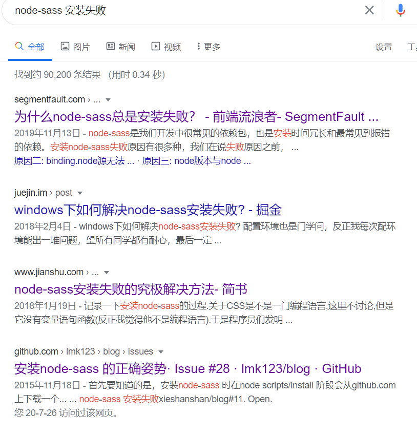
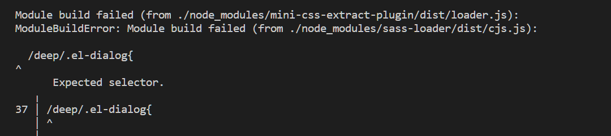

解决node-sass 安装失败
==========

 <div style="text-align: right">  2020/7/27 </div>

# 背景
node-sass 安装是一个很头大的问题，遇到在本地node-sass 安装成功，但是当代码在服务器打包，就会存在node-sass 下载失败的问题。
```
gyp ERR! stack     at E (/builds/test/test-page/node_modules/which/which.js:80:29)
gyp ERR! stack     at /builds/test/test-page/node_modules/which/which.js:89:16
gyp ERR! stack     at /builds/test/test-page/node_modules/isexe/index.js:42:5
gyp ERR! stack     at /builds/test/test-page/node_modules/isexe/mode.js:8:5
gyp ERR! stack     at FSReqWrap.oncomplete (fs.js:170:21)
gyp ERR! System Linux 3.10.0-327.36.3.el7.x86_64
gyp ERR! command "/usr/bin/node" "/builds/test/test-page/node_modules/node-gyp/bin/node-gyp.js" "rebuild" "--verbose" "--libsass_ext=" "--libsass_cflags=" "--libsass_ldflags=" "--libsass_library="
gyp ERR! cwd /builds/test/test-page/node_modules/node-sass
gyp ERR! node -v v9.11.2
gyp ERR! node-gyp -v v3.8.0
gyp ERR! not ok 
Build failed with error code: 1
npm WARN supportapp@3.9.0 No repository field.
npm WARN The package mockjs is included as both a dev and production dependency.
npm WARN optional SKIPPING OPTIONAL DEPENDENCY: fsevents@1.2.13 (node_modules/webpack-dev-server/node_modules/fsevents):
npm WARN notsup SKIPPING OPTIONAL DEPENDENCY: Unsupported platform for fsevents@1.2.13: wanted {"os":"darwin","arch":"any"} (current: {"os":"linux","arch":"x64"})
npm WARN optional SKIPPING OPTIONAL DEPENDENCY: fsevents@1.2.13 (node_modules/watchpack-chokidar2/node_modules/fsevents):
npm WARN notsup SKIPPING OPTIONAL DEPENDENCY: Unsupported platform for fsevents@1.2.13: wanted {"os":"darwin","arch":"any"} (current: {"os":"linux","arch":"x64"})
npm WARN optional SKIPPING OPTIONAL DEPENDENCY: fsevents@1.2.13 (node_modules/sane/node_modules/fsevents):
npm WARN notsup SKIPPING OPTIONAL DEPENDENCY: Unsupported platform for fsevents@1.2.13: wanted {"os":"darwin","arch":"any"} (current: {"os":"linux","arch":"x64"})
npm WARN optional SKIPPING OPTIONAL DEPENDENCY: fsevents@1.2.13 (node_modules/@jest/transform/node_modules/fsevents):
npm WARN notsup SKIPPING OPTIONAL DEPENDENCY: Unsupported platform for fsevents@1.2.13: wanted {"os":"darwin","arch":"any"} (current: {"os":"linux","arch":"x64"})
npm WARN optional SKIPPING OPTIONAL DEPENDENCY: fsevents@2.1.3 (node_modules/fsevents):
npm WARN notsup SKIPPING OPTIONAL DEPENDENCY: Unsupported platform for fsevents@2.1.3: wanted {"os":"darwin","arch":"any"} (current: {"os":"linux","arch":"x64"})

npm ERR! code ELIFECYCLE
npm ERR! errno 1
npm ERR! node-sass@4.14.1 postinstall: `node scripts/build.js`
npm ERR! Exit status 1
npm ERR! 
npm ERR! Failed at the node-sass@4.14.1 postinstall script.
npm ERR! This is probably not a problem with npm. There is likely additional logging output above.

npm ERR! A complete log of this run can be found in:
npm ERR!     /root/.npm/_logs/2020-07-24T06_43_33_364Z-debug.log
ERROR: Job failed: exit code 1
```
这个问题一搜索发现一大堆的解决方案，可是尝试了网上很多方式都没有最终解决这个问题。


# 尝试解决方式
尝试一下网上提供方法
* npm源速度慢 替换node-sass 下载地址 
  
  `npm config set registry https://registry.npm.taobao.org` 
  
  或者通过 .npmrc 文件进行配置
  `sass_binary_site=https://npm.taobao.org/mirrors/node-sass`
* 安装失败后重新安装，有可能无权限删除已安装内容，此时
 
  `npm uninstall node-sass` 

  或手动删掉原目录后再安装即可。
* 平台缺少编译环境

   `npm install -g node-gyp`

* 下载 .node 到本地,到这里去根据版本号、系统环境，选择下载 .node 文件，然后安装时，指定变量 sass_binary_path，如：
  
  `npm i node-sass --sass_binary_path=/Users/lzwme/Downloads/darwin-x64-48_binding.node`
此方法不是万能方式，属于定制化，对于不同项目部署很不友好，所有抛弃了
以上的方法，如果你尝试过之后发现正常运行了，那恭喜你，可是我并没有那么幸运，使用完所有的方式一九不能解决问题。很是郁闷。可能幸运女神没有降临到我这里。
最后使用了终级大法
# 终级解决方案 drat-sass 替换 node-sass
既然node-sass 这么难用，我觉得抛弃它，然后找到了drat-sass
## 什么是 drat-sass
Dart Sass 是 Sass 的主要实现版本，这意味着它集成新 功能要早于任何其它的实现版本。Dart Sass 速度快、易于安装，并且 可以被编译成纯 JavaScript 代码，这使得它很容易集成到现代 web 的开发流程中
## drat-sass 与 node-sass 区别
 纯 JS 版本 比独立版本执行速度慢，但是它很容易集成到 现有的工作流中，并且允许你通过 JavaScript 自定义函数和 importer。

 通过 npm 安装时，Dart Sass 提供了一个 JavaScript API 用于 兼容 Node Sass。 完全兼容的工作正在进行中，但是 Dart Sass 目前支持 render() 和 renderSync() 函数。不过，请注意，默认情况下 renderSync() 的速度是 render() 的两倍以上，这是由于 异步回调所带来的开销而导致的。

 dart-sass进行构建，它能在保证性能的前提下大大简化用户的安装成本。通过这个 issue下面相关的评论就可以知道，安装 node-sass 是多么麻烦的一件事。

 这里选择使用dart-sass还有一个更主要的原因，sass官方已经将dart-sass作为未来主要的的开发方向了，有任何新功能它都是会优先支持的，而且它已经在社区里稳定运行了很长的一段时间，基本没有什么坑了。dart-sass之所以容易安装，主要是因为它会被编译成纯 js，这样就可以直接在的 node 环境中使用。虽然这样它的运行速度会比基于 libsass的慢一些些，但这些速度的差异几乎可以忽略不计。整个社区现在都在拥抱dart-sass，我们没有理由拒绝！而且它的确大大简化了用户的安装成本
 ## 如何无缝从node-sass 切换到 drat-sass
 1. 删除项目原有的node_modlues 其主要目的是防止卸载node-sass 过程中代码异常


     `rm -rf node_modlues`
2. 安装drat-sass 

    `npm install sass sass-loader -D`
3. 配置drat-sass,修改vue.config.js 

    ```js
    module.exports = {
        ....
        css: {
            loaderOptions: {
                sass: {
                    implementation: require('sass')
                }
            }
        },
    ....
    }
    ```
经过以上步骤，然后自信满满的执行
然后有一次被现实打败了

报错了，从提示信息看，应该是不能解析`/deep/`

替换 node-sass 之后有一个地方需要注意，就是它不再支持之前 sass 的那种 /deep/ 写法，需要统一改为 ::v-deep 的写法

具体 demo：

``` css
.a {
  /deep/ {
    .b {
      color: red;
    }
  }
}

/* 修改为 */
.a {
  ::v-deep {
    .b {
      color: red;
    }
  }
}
```
然后终于完美解决
晚上加鸡腿，撒花

# 参考文章
* [drat sass 官网](https://www.sasscss.com/dart-sass)
* [Node Sass to Dart Sass](https://panjiachen.github.io/vue-element-admin-site/zh/guide/advanced/sass.html#%E5%8D%87%E7%BA%A7%E6%96%B9%E6%A1%88)